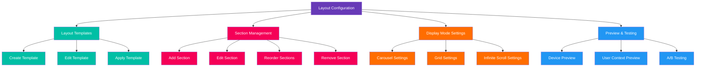
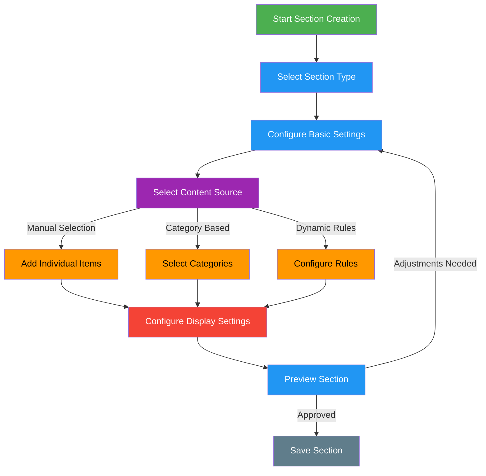
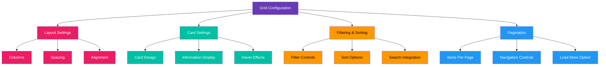
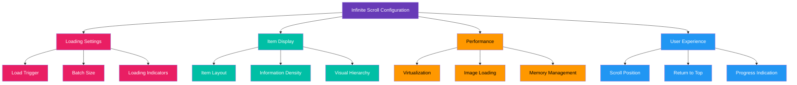
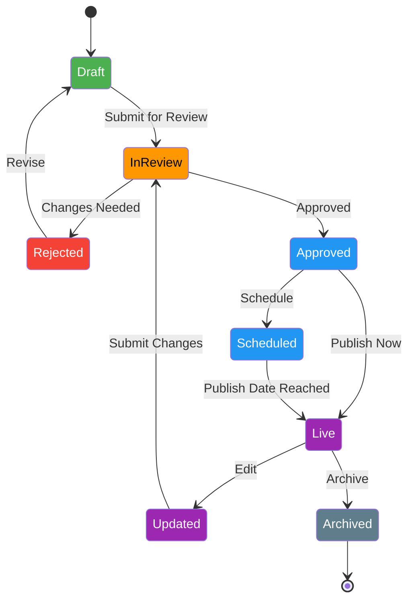

# Store Layout Configuration

[← Back to Admin Interface](README.md) | [View Documentation Map](../../DocNavigation.md)

## Overview

The Layout Configuration section of the administration interface allows store administrators and content managers to design and customize the visual layout of the in-game store. This includes creating and managing sections, configuring display modes, and arranging products for optimal presentation.

## Layout Editor

The layout editor provides a visual interface for configuring the store's appearance and organization:



### Layout Editor Interface

```
+-------------------------------------------------------+
|  STORE ADMIN > LAYOUT > EDITOR                        |
+-------------------------------------------------------+
|                                                       |
|  LAYOUT: [Default ▼] [+ New Layout] [Duplicate]       |
|                                                       |
|  SECTIONS:                                            |
|  [+ Add Section]                                      |
|                                                       |
|  +-------------------------------------------------+  |
|  | FEATURED CAROUSEL (drag to reorder)             |  |
|  | [Edit] [Delete] [↑] [↓]                        |  |
|  +-------------------------------------------------+  |
|                                                       |
|  +-------------------------------------------------+  |
|  | DAILY DEALS (drag to reorder)                   |  |
|  | [Edit] [Delete] [↑] [↓]                        |  |
|  +-------------------------------------------------+  |
|                                                       |
|  +-------------------------------------------------+  |
|  | CATEGORY GRID: WEAPONS (drag to reorder)        |  |
|  | [Edit] [Delete] [↑] [↓]                        |  |
|  +-------------------------------------------------+  |
|                                                       |
|  PREVIEW:                                             |
|  +-------------------------------------------------+  |
|  |                                                 |  |
|  |  [Desktop ▼] [Refresh] [Full Preview]          |  |
|  |                                                 |  |
|  |  +---------------------------------------+      |  |
|  |  |                                       |      |  |
|  |  |        Interactive Preview            |      |  |
|  |  |                                       |      |  |
|  |  +---------------------------------------+      |  |
|  |                                                 |  |
|  +-------------------------------------------------+  |
|                                                       |
|  [SAVE DRAFT]    [SCHEDULE]    [PUBLISH]             |
|                                                       |
+-------------------------------------------------------+
```

## Section Editor

The section editor allows for detailed configuration of individual store sections:

```
+-------------------------------------------------------+
|  STORE ADMIN > LAYOUT > SECTION EDITOR                |
+-------------------------------------------------------+
|                                                       |
|  SECTION TYPE: [Carousel ▼]                           |
|                                                       |
|  BASIC SETTINGS                                       |
|  +-------------------------------------------------+  |
|  | Title:       [Featured Items]                   |  |
|  | Description: [Check out our featured items]     |  |
|  | Display Mode:[Carousel ▼]                       |  |
|  | Items Per Row:[4] (desktop) [2] (mobile)        |  |
|  | Background:  [Select Color] or [Select Image]   |  |
|  +-------------------------------------------------+  |
|                                                       |
|  CONTENT                                              |
|  +-------------------------------------------------+  |
|  | Content Type:[Manual Selection ▼]               |  |
|  |                                                 |  |
|  | SELECTED ITEMS:                                 |  |
|  | [+ Add Items]                                   |  |
|  |                                                 |  |
|  | +--------+  +--------+  +--------+             |  |
|  | |        |  |        |  |        |             |  |
|  | | ITEM 1 |  | ITEM 2 |  | ITEM 3 |  [+ Add]    |  |
|  | |  [×]   |  |  [×]   |  |  [×]   |             |  |
|  | +--------+  +--------+  +--------+             |  |
|  |                                                 |  |
|  | [Reorder Items]                                 |  |
|  +-------------------------------------------------+  |
|                                                       |
|  DISPLAY SETTINGS                                     |
|  +-------------------------------------------------+  |
|  | Animation:   [Fade ▼]                           |  |
|  | Auto-rotate: [✓] Every [5] seconds              |  |
|  | Show Arrows: [✓]                                |  |
|  | Show Dots:   [✓]                                |  |
|  | Card Style:  [Standard ▼]                       |  |
|  +-------------------------------------------------+  |
|                                                       |
|  [CANCEL]    [SAVE]                                   |
|                                                       |
+-------------------------------------------------------+
```

### Section Configuration Flow



## Display Mode Configuration

### Carousel Configuration

```mermaid
graph TD
    A[Carousel Configuration] --> B[Visual Settings]
    A --> C[Behavior Settings]
    A --> D[Content Settings]
    A --> E[Responsive Settings]
    
    B --> B1[Card Design]
    B --> B2[Navigation Controls]
    B --> B3[Indicators]
    B --> B4[Transitions]
    
    C --> C1[Auto-rotation]
    C --> C2[Interaction Behavior]
    C --> C3[Looping]
    C --> C4[Preloading]
    
    D --> D1[Featured Item]
    D --> D2[Item Information]
    D --> D3[Call to Action]
    
    E --> E1[Mobile Adaptation]
    E --> E2[Tablet Adaptation]
    E --> E3[Desktop Adaptation]
    
    classDef main fill:#673AB7,color:white
    classDef visual fill:#E91E63,color:white
    classDef behavior fill:#00BFA5,color:white
    classDef content fill:#FF9800,color:black
    classDef responsive fill:#2196F3,color:white
    
    class A main
    class B,B1,B2,B3,B4 visual
    class C,C1,C2,C3,C4 behavior
    class D,D1,D2,D3 content
    class E,E1,E2,E3 responsive
```



### Grid Configuration



### Infinite Scroll Configuration



## Layout Templates

The system provides pre-designed templates for common store layouts:

```mermaid
graph TD
    A[Layout Templates] --> B[Featured Focus]
    A --> C[Category Grid]
    A --> D[Seasonal Event]
    A --> E[New Releases]
    A --> F[Custom Template]
    
    B --> B1[Hero Carousel]
    B --> B2[Featured Grid]
    B --> B3[Recommendations]
    
    C --> C1[Category Navigation]
    C --> C2[Subcategory Grids]
    C --> C3[Featured Category Items]
    
    D --> D1[Event Banner]
    D --> D2[Limited-Time Items]
    D --> D3[Countdown Timer]
    
    E --> E1[New Items Showcase]
    E --> E2[Release Calendar]
    E --> E3[Coming Soon Section]
    
    F --> F1[User-Created Templates]
    
    classDef main fill:#673AB7,color:white
    classDef featured fill:#E91E63,color:white
    classDef category fill:#00BFA5,color:white
    classDef seasonal fill:#FF9800,color:black
    classDef new fill:#2196F3,color:white
    classDef custom fill:#607D8B,color:white
    
    class A main
    class B,B1,B2,B3 featured
    class C,C1,C2,C3 category
    class D,D1,D2,D3 seasonal
    class E,E1,E2,E3 new
    class F,F1 custom
```



## Layout Versioning and History

The layout versioning system allows for tracking changes and managing layout history:



## Implementation Considerations

1. **Performance Optimization**
   - Efficient rendering of complex layouts
   - Optimized image loading and caching
   - Responsive design considerations

2. **Drag-and-Drop Interface**
   - Intuitive drag-and-drop for section reordering
   - Visual feedback during drag operations
   - Undo/redo functionality

3. **Preview Capabilities**
   - Accurate representation of the final store appearance
   - Device-specific previews (mobile, tablet, desktop)
   - User context simulation (new user, returning user, etc.)

4. **Responsive Design Tools**
   - Visual indicators for breakpoints
   - Device-specific configuration options
   - Automatic adaptation suggestions

5. **Integration with Product Management**
   - Seamless product selection interface
   - Real-time updates when products change
   - Validation to prevent layout issues 