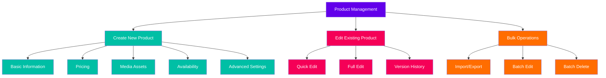
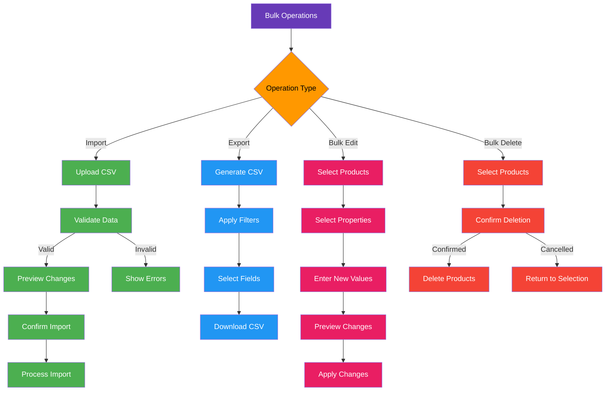
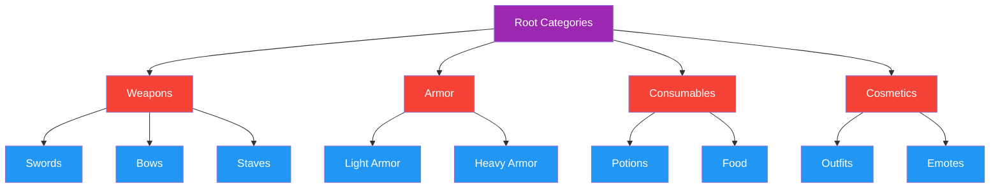
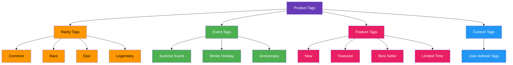
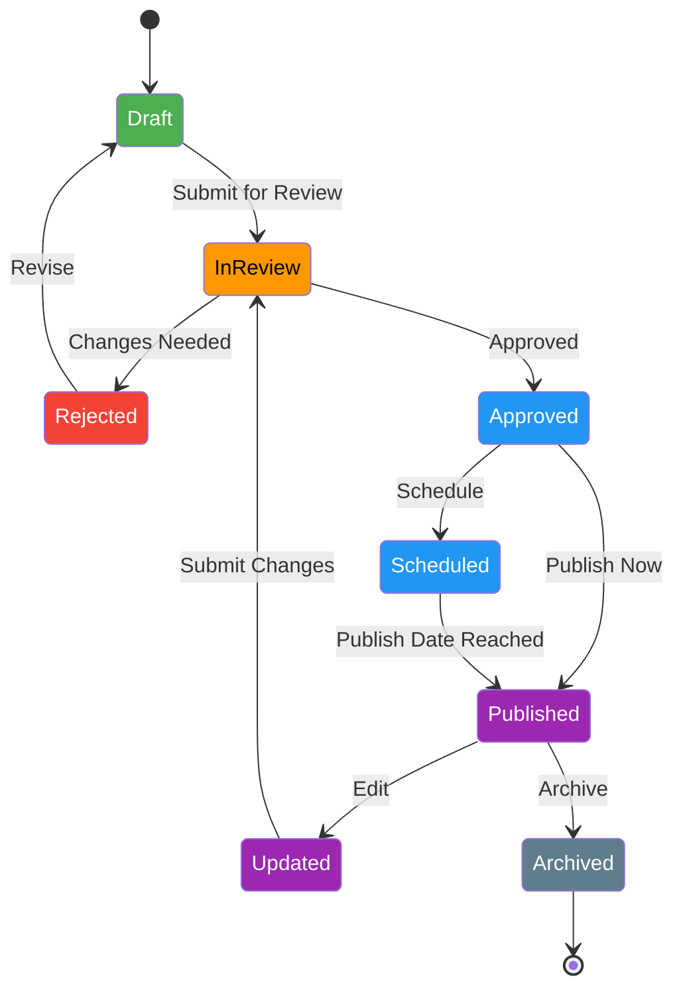

# Product Management

[← Back to Admin Interface](README.md) | [View Documentation Map](../../DocNavigation.md)

## Overview

The Product Management section of the administration interface allows store administrators and content managers to create, edit, organize, and manage all products available in the game store.

## Product Creation and Editing

The product editor provides a comprehensive interface for managing all aspects of store products:



### Product Editor Interface

```
+-------------------------------------------------------+
|  STORE ADMIN > PRODUCTS > NEW PRODUCT                 |
+-------------------------------------------------------+
|                                                       |
|  BASIC INFORMATION                                    |
|  +-------------------------------------------------+  |
|  | Product Name: [________________________]        |  |
|  | Product ID:   [____________] [Generate] [Check] |  |
|  | Description:  [________________________]        |  |
|  |               [________________________]        |  |
|  | Category:     [Select Category ▼]               |  |
|  | Subcategory:  [Select Subcategory ▼]            |  |
|  +-------------------------------------------------+  |
|                                                       |
|  PRICING                                              |
|  +-------------------------------------------------+  |
|  | Base Price:   [______] [Currency Type ▼]        |  |
|  | Discount:     [______] % or [______] flat       |  |
|  | Final Price:  1000 (calculated automatically)   |  |
|  | Sale Period:  [Start Date] to [End Date]        |  |
|  +-------------------------------------------------+  |
|                                                       |
|  MEDIA                                                |
|  +-------------------------------------------------+  |
|  | Main Image:   [Select File] or [Drag & Drop]    |  |
|  | Gallery:      [Manage Gallery]                  |  |
|  | Preview Video:[URL____________]                 |  |
|  +-------------------------------------------------+  |
|                                                       |
|  AVAILABILITY                                         |
|  +-------------------------------------------------+  |
|  | Status:       [Active ▼]                        |  |
|  | Visibility:   [Public ▼]                        |  |
|  | Available:    [Start Date] to [End Date]        |  |
|  | Platforms:    [✓] PC [✓] Console [✓] Mobile    |  |
|  | Regions:      [✓] All or [Select Regions]       |  |
|  +-------------------------------------------------+  |
|                                                       |
|  ADVANCED                                             |
|  +-------------------------------------------------+  |
|  | Tags:         [_________] [+ Add]               |  |
|  | Rarity:       [Select Rarity ▼]                 |  |
|  | Purchase Limit:[_____] per [User ▼]             |  |
|  | Related Items: [Select Items]                   |  |
|  +-------------------------------------------------+  |
|                                                       |
|  [SAVE DRAFT]    [PREVIEW]    [PUBLISH]              |
|                                                       |
+-------------------------------------------------------+
```

### Product Creation Flow

```mermaid
flowchart TD
    A[Start Product Creation] --> B[Enter Basic Information]
    B --> C[Configure Pricing]
    C --> D[Upload Media Assets]
    D --> E[Set Availability]
    E --> F[Configure Advanced Settings]
    F --> G{Save Options}
    G -->|Save Draft| H[Draft Saved]
    G -->|Preview| I[Preview Mode]
    G -->|Publish| J{Role Check}
    J -->|Administrator| K[Published to Store]
    J -->|Content Manager| L[Submit for Approval]
    L --> M[Await Approval]
    M -->|Approved| K
    M -->|Rejected| N[Revision Needed]
    N --> B
    
    classDef start fill:#4CAF50,color:white
    classDef process fill:#2196F3,color:white
    classDef decision fill:#9C27B0,color:white
    classDef end fill:#F44336,color:white
    classDef approval fill:#FF9800,color:black
    
    class A start
    class B,C,D,E,F process
    class G,J decision
    class H,I,K end
    class L,M,N approval
```

## Product Bulk Management

The bulk management interface allows for efficient handling of multiple products:

```
+-------------------------------------------------------+
|  STORE ADMIN > PRODUCTS > BULK OPERATIONS             |
+-------------------------------------------------------+
|                                                       |
|  [Import CSV] [Export CSV] [Bulk Edit] [Bulk Delete]  |
|                                                       |
|  FILTERS:                                             |
|  [Category ▼] [Status ▼] [Date Range] [Search...]     |
|                                                       |
+-------------------------------------------------------+
|                                                       |
|  [✓] Select All                                       |
|                                                       |
|  +---+----------+-------------+--------+----------+   |
|  | ✓ | ID       | Name        | Price  | Status   |   |
|  +---+----------+-------------+--------+----------+   |
|  | ✓ | ITEM-001 | Product 1   | $9.99  | Active   |   |
|  | ✓ | ITEM-002 | Product 2   | $19.99 | Active   |   |
|  |   | ITEM-003 | Product 3   | $4.99  | Draft    |   |
|  | ✓ | ITEM-004 | Product 4   | $14.99 | Active   |   |
|  |   | ITEM-005 | Product 5   | $24.99 | Scheduled|   |
|  +---+----------+-------------+--------+----------+   |
|                                                       |
|  WITH SELECTED:                                       |
|  [Set Category ▼] [Set Status ▼] [Set Price] [Delete] |
|                                                       |
+-------------------------------------------------------+
```

### Bulk Operations Flow



## Product Organization

### Category Management

The category management system allows for organizing products into a hierarchical structure:



### Product Tagging System

Products can be tagged for flexible organization beyond categories:



## Product Versioning

The product versioning system allows for tracking changes and managing product history:



## Implementation Considerations

1. **Performance Optimization**
   - Efficient handling of large product catalogs
   - Pagination and lazy loading for product lists
   - Optimized search and filtering

2. **Media Asset Management**
   - Support for various image formats and resolutions
   - Automatic image optimization and resizing
   - Preview generation for different device contexts

3. **Validation and Error Handling**
   - Comprehensive validation for all product fields
   - Clear error messages and suggestions
   - Prevention of duplicate product IDs

4. **Localization Support**
   - Multi-language product information
   - Region-specific pricing and availability
   - Currency conversion and formatting

5. **Integration Points**
   - Connection to inventory management systems
   - Integration with analytics for product performance
   - API endpoints for external systems