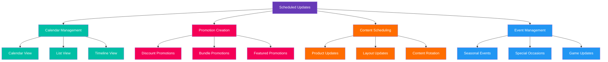
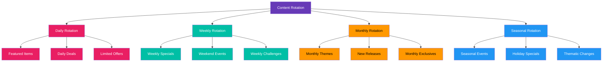
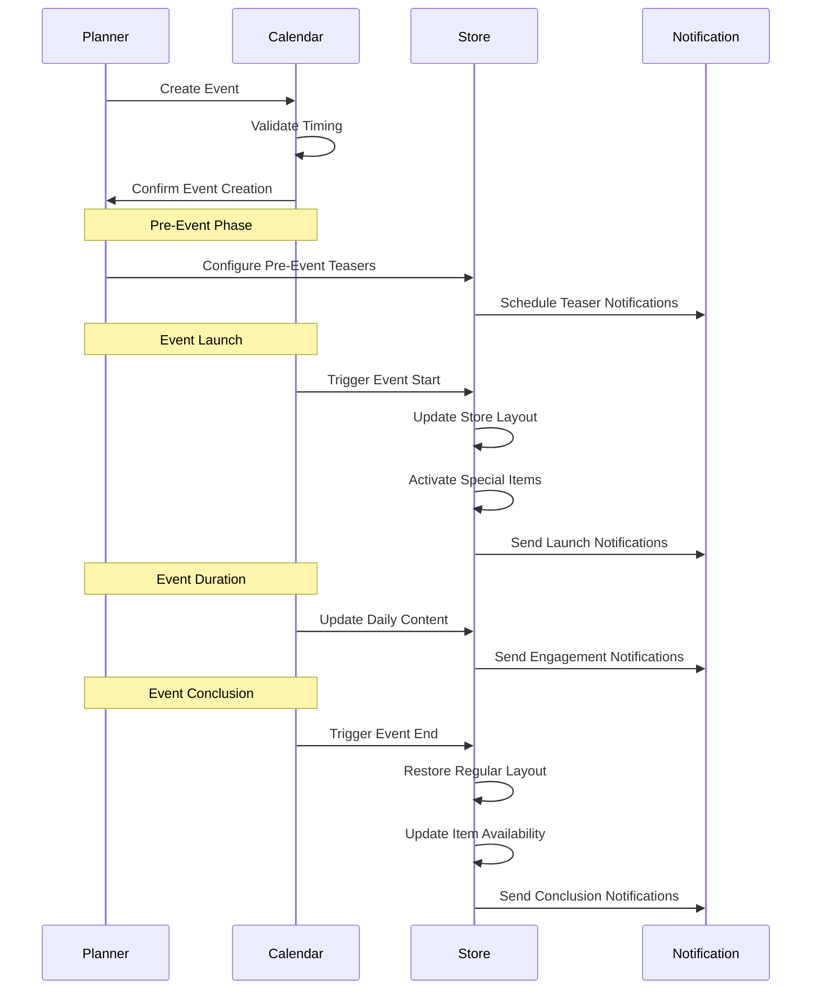

# Scheduled Updates & Promotions

[← Back to Admin Interface](README.md) | [View Documentation Map](../../DocNavigation.md)

## Overview

The Scheduled Updates & Promotions section of the administration interface allows store administrators and content managers to plan and schedule content updates, create time-based promotions, and manage seasonal or event-based content.

## Calendar View

The calendar view provides a visual interface for scheduling and managing store updates:



### Calendar Interface

```
+-------------------------------------------------------+
|  STORE ADMIN > SCHEDULE > CALENDAR                    |
+-------------------------------------------------------+
|                                                       |
|  [Month ▼] [Week] [List]    [Today] [< Prev] [Next >] |
|                                                       |
|  APRIL 2023                                           |
|  +---+---+---+---+---+---+---+                        |
|  |Mon|Tue|Wed|Thu|Fri|Sat|Sun|                        |
|  +---+---+---+---+---+---+---+                        |
|  |   |   |   |   |   | 1 | 2 |                        |
|  |   |   |   |   |   |   |   |                        |
|  +---+---+---+---+---+---+---+                        |
|  | 3 | 4 | 5 | 6 | 7 | 8 | 9 |                        |
|  |[A]|   |[B]|   |[C]|   |   |                        |
|  +---+---+---+---+---+---+---+                        |
|  | 10| 11| 12| 13| 14| 15| 16|                        |
|  |   |[D]|   |   |[E]|   |   |                        |
|  +---+---+---+---+---+---+---+                        |
|  | 17| 18| 19| 20| 21| 22| 23|                        |
|  |[F]|   |   |[G]|   |   |   |                        |
|  +---+---+---+---+---+---+---+                        |
|  | 24| 25| 26| 27| 28| 29| 30|                        |
|  |   |[H]|   |   |[I]|   |   |                        |
|  +---+---+---+---+---+---+---+                        |
|                                                       |
|  LEGEND:                                              |
|  [A] Daily Rotation   [B] New Items                   |
|  [C] Weekend Sale     [D] Special Event               |
|  [E] Layout Change    [F] Seasonal Theme              |
|  [G] Flash Sale       [H] Maintenance                 |
|  [I] Major Update                                     |
|                                                       |
|  [+ New Event]                                        |
|                                                       |
+-------------------------------------------------------+
```

## Promotion Editor

The promotion editor allows for creating and configuring various types of promotions:

```
+-------------------------------------------------------+
|  STORE ADMIN > SCHEDULE > NEW PROMOTION               |
+-------------------------------------------------------+
|                                                       |
|  BASIC INFORMATION                                    |
|  +-------------------------------------------------+  |
|  | Promotion Name: [Spring Sale]                   |  |
|  | Description:    [Celebrate spring with...]      |  |
|  | Type:           [Discount ▼]                    |  |
|  | Priority:       [High ▼]                        |  |
|  +-------------------------------------------------+  |
|                                                       |
|  TIMING                                               |
|  +-------------------------------------------------+  |
|  | Start Date:     [04/15/2023] [10:00 AM]         |  |
|  | End Date:       [04/22/2023] [11:59 PM]         |  |
|  | Time Zone:      [UTC ▼]                         |  |
|  | Recurrence:     [None ▼]                        |  |
|  +-------------------------------------------------+  |
|                                                       |
|  DISCOUNT SETTINGS                                    |
|  +-------------------------------------------------+  |
|  | Discount Type:  [Percentage ▼]                  |  |
|  | Discount Value: [25] %                          |  |
|  | Min Purchase:   [0]                             |  |
|  | Max Discount:   [No limit]                      |  |
|  +-------------------------------------------------+  |
|                                                       |
|  APPLICABLE ITEMS                                     |
|  +-------------------------------------------------+  |
|  | Apply To:       [Selected Categories ▼]         |  |
|  |                                                 |  |
|  | CATEGORIES:                                     |  |
|  | [✓] Weapons                                     |  |
|  |    [✓] Swords                                   |  |
|  |    [✓] Bows                                     |  |
|  |    [  ] Staves                                  |  |
|  | [  ] Armor                                      |  |
|  | [✓] Consumables                                 |  |
|  |                                                 |  |
|  | EXCLUSIONS:                                     |  |
|  | [+ Add Items to Exclude]                        |  |
|  +-------------------------------------------------+  |
|                                                       |
|  DISPLAY                                              |
|  +-------------------------------------------------+  |
|  | Banner:        [Select Image]                   |  |
|  | Label:         [SPRING SALE]                    |  |
|  | Label Color:   [#FF5500]                        |  |
|  | Show Timer:    [✓]                              |  |
|  | Featured:      [✓] On homepage                  |  |
|  +-------------------------------------------------+  |
|                                                       |
|  [CANCEL]    [SAVE DRAFT]    [SCHEDULE]              |
|                                                       |
+-------------------------------------------------------+
```

### Promotion Creation Flow

```mermaid
flowchart TD
    A[Start Promotion Creation] --> B[Enter Basic Information]
    B --> C[Configure Timing]
    C --> D{Promotion Type}
    D -->|Discount| E[Configure Discount Settings]
    D -->|Bundle| F[Configure Bundle Settings]
    D -->|Featured| G[Configure Featured Settings]
    E --> H[Select Applicable Items]
    F --> H
    G --> H
    H --> I[Configure Display Settings]
    I --> J[Preview Promotion]
    J -->|Adjustments Needed| B
    J -->|Approved| K{Save Options}
    K -->|Save Draft| L[Draft Saved]
    K -->|Schedule| M[Promotion Scheduled]
    
    classDef start fill:#4CAF50,color:white
    classDef process fill:#2196F3,color:white
    classDef decision fill:#9C27B0,color:white
    classDef type fill:#FF9800,color:black
    classDef display fill:#F44336,color:white
    classDef end fill:#607D8B,color:white
    
    class A start
    class B,C,H,I,J process
    class D,K decision
    class E,F,G type
    class L,M end
```

## Promotion Types

The system supports various types of promotions:

```mermaid
graph TD
    A[Promotion Types] --> B[Discount Promotions]
    A --> C[Bundle Promotions]
    A --> D[Featured Promotions]
    A --> E[Limited-Time Items]
    A --> F[Custom Promotions]
    
    B --> B1[Percentage Discount]
    B --> B2[Fixed Amount Discount]
    B --> B3[Buy X Get Y]
    
    C --> C1[Package Bundles]
    C --> C2[Themed Bundles]
    C --> C3[Value Bundles]
    
    D --> D1[Homepage Feature]
    D --> D2[Category Feature]
    D --> D3[Spotlight Feature]
    
    E --> E1[Exclusive Items]
    E --> E2[Early Access]
    E --> E3[Last Chance]
    
    F --> F1[User-Defined Promotions]
    
    classDef main fill:#673AB7,color:white
    classDef discount fill:#E91E63,color:white
    classDef bundle fill:#00BFA5,color:white
    classDef featured fill:#FF9800,color:black
    classDef limited fill:#2196F3,color:white
    classDef custom fill:#607D8B,color:white
    
    class A main
    class B,B1,B2,B3 discount
    class C,C1,C2,C3 bundle
    class D,D1,D2,D3 featured
    class E,E1,E2,E3 limited
    class F,F1 custom
```



## Content Rotation System

The content rotation system allows for scheduling regular updates to store content:



## Event Planning

The event planning system allows for creating and managing special events:



## Conflict Resolution

The system includes tools for identifying and resolving scheduling conflicts:

```mermaid
flowchart TD
    A[Schedule New Item] --> B{Check for Conflicts}
    B -->|No Conflicts| C[Schedule Confirmed]
    B -->|Conflicts Detected| D[View Conflicts]
    D --> E{Resolve Conflicts}
    E -->|Adjust Timing| F[Modify Schedule]
    E -->|Override| G[Set Priority]
    E -->|Cancel New| H[Abandon Scheduling]
    F --> B
    G --> I[Confirm Override]
    I --> C
    H --> J[End Process]
    
    classDef start fill:#4CAF50,color:white
    classDef check fill:#FF9800,color:black
    classDef conflict fill:#F44336,color:white
    classDef resolve fill:#9C27B0,color:white
    classDef action fill:#2196F3,color:white
    classDef end fill:#607D8B,color:white
    
    class A start
    class B,D check
    class E resolve
    class F,G,H action
    class C,I,J end
```

## Implementation Considerations

1. **Time Zone Management**
   - Support for multiple time zones
   - Clear indication of time zone context
   - Automatic conversion for global teams

2. **Conflict Detection**
   - Automated identification of scheduling conflicts
   - Visual indicators for overlapping events
   - Prioritization system for resolving conflicts

3. **Recurrence Patterns**
   - Support for complex recurrence rules
   - Visual representation of recurring events
   - Exception handling for recurring events

4. **Preview Capabilities**
   - Timeline visualization of scheduled changes
   - Preview of store appearance at specific dates
   - Simulation of user experience during events

5. **Integration with Other Systems**
   - Connection to product management
   - Integration with layout configuration
   - Synchronization with external marketing calendars 