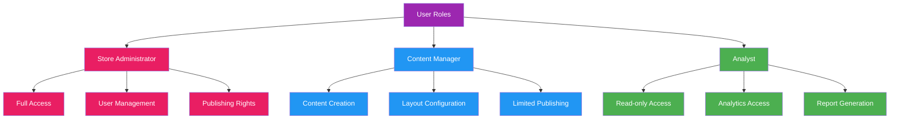
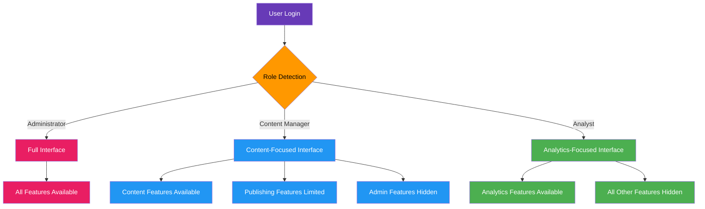
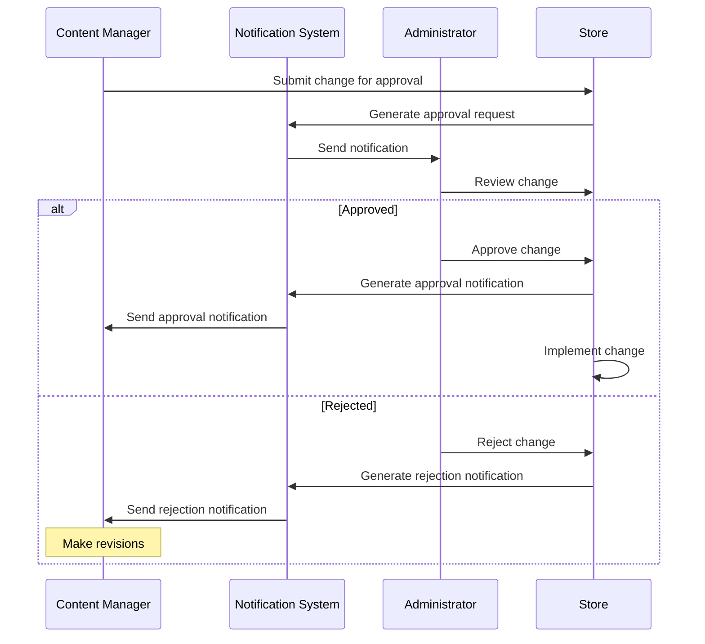

# User Roles and Permissions

[← Back to Admin Interface](README.md) | [View Documentation Map](../../DocNavigation.md)

## Overview

The administration interface supports multiple user roles with different permission levels to ensure proper access control and workflow management.

## Role Hierarchy

## Role Descriptions

### 1. Store Administrator

**Description:**  
Store Administrators have full access to all store configuration features and are responsible for the overall management of the store.

**Permissions:**
- Create, edit, and delete all store content
- Manage user permissions and roles
- Publish changes to production
- Access all analytics and reporting
- Configure system settings
- Manage version control and rollbacks

**Typical Users:**
- Game producers
- Store managers
- Senior product managers

### 2. Content Manager

**Description:**  
Content Managers are responsible for creating and organizing store products, configuring layouts, and scheduling updates.

**Permissions:**
- Create, edit, and organize store products
- Configure store layouts and promotions
- Schedule content updates
- Preview store changes
- Submit changes for approval
- Limited publishing rights (requires approval for major changes)

**Typical Users:**
- Content creators
- Marketing specialists
- Junior product managers

### 3. Analyst

**Description:**  
Analysts have read-only access to store performance data and are responsible for monitoring metrics and generating reports.

**Permissions:**
- View store performance data
- Generate and export reports
- Create and save custom dashboards
- Set up alerts and notifications
- No ability to modify store content or configuration

**Typical Users:**
- Data analysts
- Business intelligence specialists
- Marketing analysts

## Permission Matrix

| Feature | Administrator | Content Manager | Analyst |
|---------|---------------|-----------------|---------|
| **Product Management** |
| Create Products | ✅ | ✅ | ❌ |
| Edit Products | ✅ | ✅ | ❌ |
| Delete Products | ✅ | ⚠️ (With approval) | ❌ |
| **Layout Configuration** |
| Create Layouts | ✅ | ✅ | ❌ |
| Edit Layouts | ✅ | ✅ | ❌ |
| Publish Layouts | ✅ | ⚠️ (With approval) | ❌ |
| **Scheduled Updates** |
| Create Promotions | ✅ | ✅ | ❌ |
| Schedule Updates | ✅ | ✅ | ❌ |
| Publish Updates | ✅ | ⚠️ (With approval) | ❌ |
| **Testing & Publishing** |
| Deploy to Sandbox | ✅ | ✅ | ❌ |
| Deploy to Production | ✅ | ❌ | ❌ |
| Rollback Changes | ✅ | ❌ | ❌ |
| **Analytics** |
| View Reports | ✅ | ✅ | ✅ |
| Create Reports | ✅ | ✅ | ✅ |
| Export Data | ✅ | ✅ | ✅ |
| **User Management** |
| Create Users | ✅ | ❌ | ❌ |
| Assign Roles | ✅ | ❌ | ❌ |
| Manage Permissions | ✅ | ❌ | ❌ |

## Role-Based Interface Adaptation

The administration interface adapts based on the user's role:

## Workflow Approval Process

For actions requiring approval, the following workflow is implemented:

## Implementation Considerations

1. **Role-Based Access Control (RBAC)**
   - Implement a robust RBAC system to manage permissions
   - Support for custom roles beyond the three primary roles
   - Granular permission settings for specific features

2. **Audit Trail**
   - Log all actions performed by users
   - Track changes to permissions and roles
   - Provide visibility into who made what changes and when

3. **Temporary Access**
   - Support for temporary role elevation
   - Time-limited access for specific tasks
   - Emergency access protocols

4. **Multi-Factor Authentication**
   - Require MFA for administrator accounts
   - Additional verification for sensitive operations
   - Session timeout and security measures 