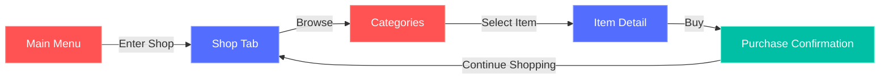
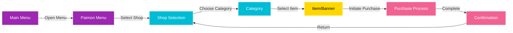
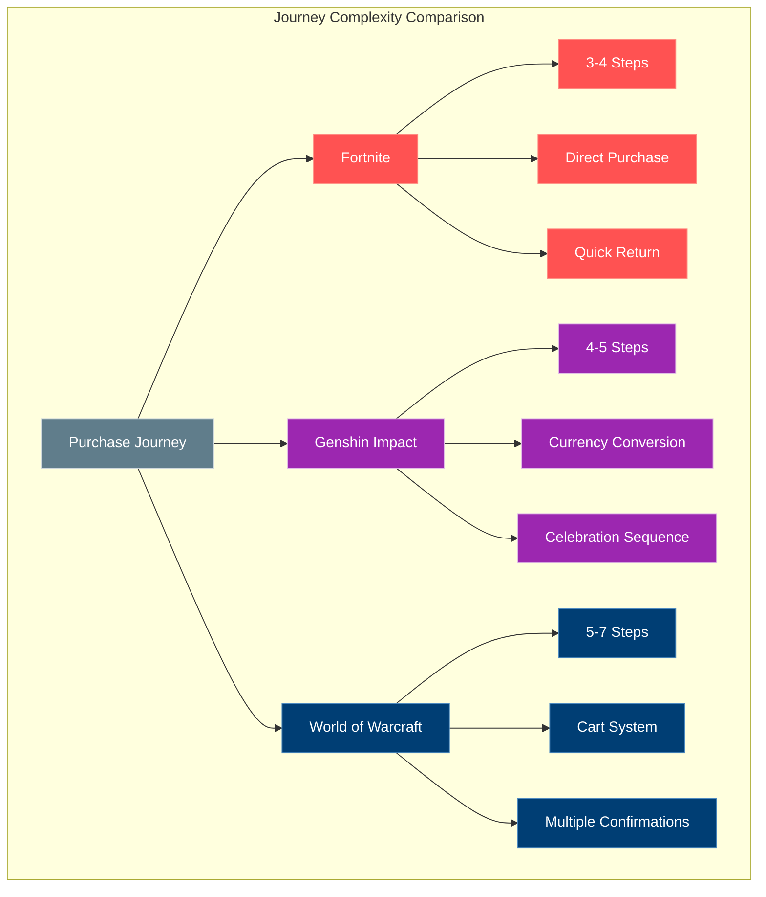
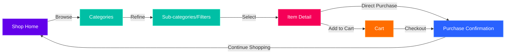

# Animation and Navigation Analysis: Game Store Interfaces

[← Back to Analysis](README.md) | [View Documentation Map](../DocNavigation.md)

## Navigation

- [📋 Main README](../README.md) - Overview of the entire documentation
- [📝 Project Analysis](../Analysis.md) - Analysis of the project requirements
- [📋 Analysis Overview](README.md) - Overview of the analysis process
- [📊 Comparative Analysis](ComparativeAnalysis.md) - Comparison of different game stores
- [🎯 Design Recommendations](DesignRecommendations.md) - Recommendations based on analysis
- [🎮 Fortnite Analysis](Fortnite/FortniteShopAnalysis.md) - Analysis of Fortnite's item shop
- [⚔️ Genshin Impact Analysis](GenshinImpact/GenshinImpactShopAnalysis.md) - Analysis of Genshin Impact's shop
- [🌍 World of Warcraft Analysis](WorldOfWarcraft/WoWShopAnalysis.md) - Analysis of WoW's shop

# Animation Effects and Navigation Structure Analysis

## Introduction

This document provides a detailed analysis of the animation effects and navigation structures of the three previously studied video game shop interfaces: Fortnite Item Shop, Genshin Impact Shop, and World of Warcraft Shop. The focus is on the user journey from catalog browsing to final purchase.

## Fortnite Item Shop

### Animation Effects

#### Interface Animations
1. **Category Transitions**: Smooth lateral sliding when changing tabs
2. **Appearance Animation**: Elements appear with a slight fade-in and rise effect
3. **Hover Effect**: Slight scale increase and addition of a subtle glow
4. **Selection Animation**: Light bounce effect when an item is selected
5. **3D Object Rotation**: Ability to rotate characters/objects in preview

#### Contextual Animations
1. **Time Counter**: Clock-type animation for limited-time offers
2. **"New" Notification**: Subtle flashing badge for new items
3. **Purchase Animation**: Confirmation sequence with particles and sound effects
4. **"Sold Out" Effect**: Fade transition to a grayed-out state for depleted items

### Navigation Structure

#### Main Journey
```
Main Menu → Shop Tab → Categories (Featured/Daily/Special) → Item Detail → Purchase Confirmation
```



#### Navigation Hierarchy
1. **Level 1**: Access to the shop from the game's main menu
2. **Level 2**: Selection between main sections (Featured Items, Daily Items, Special Offers)
3. **Level 3**: Grid of items in each section
4. **Level 4**: Detailed view of a specific item
5. **Level 5**: Purchase process and confirmation

#### Key Interactions
1. **Filtering**: Limited options to filter by item type
2. **Preview**: Ability to try cosmetics on your character
3. **Add to Favorites**: Wishlist system to track desired items
4. **Direct Purchase**: Simplified purchase process in 1-2 clicks
5. **Return**: Consistent back button to return to the main grid

## Genshin Impact Shop

### Animation Effects

#### Interface Animations
1. **Shop Transitions**: Page-turning effect when changing shops
2. **Banner Animations**: Particle and light effects on wish banners
3. **Card Effects**: Flip animation for cards in the gacha system
4. **Rarity Animations**: Different visual effects based on the rarity of obtained items
5. **Shine Effects**: Subtle sparkle on premium or promotional items

#### Contextual Animations
1. **Paimon (Mascot)**: Reactive animations of the guide character in the interface
2. **Time Counters**: Stylized clock animations for limited offers
3. **Currency Conversion**: Smooth animation when exchanging between different currencies
4. **Purchase Celebration**: Elaborate sequence when obtaining rare items

### Navigation Structure

#### Main Journey
```
Main Menu → Paimon Menu → Shop Selection → Category → Item/Banner → Purchase Process → Confirmation
```



#### Navigation Hierarchy
1. **Level 1**: Access to the Paimon menu from the main interface
2. **Level 2**: Selection between different shops (Crystal Top-Up, Paimon's Bargains, etc.)
3. **Level 3**: Navigation in the sub-categories of each shop
4. **Level 4**: Selection of specific items or banners
5. **Level 5**: Purchase interface with quantity/type options
6. **Level 6**: Confirmation and result animation

#### Key Interactions
1. **Multi-Currency System**: Interface for converting or purchasing different currencies
2. **Preview**: Item details with effects and statistics
3. **History**: Access to purchase and wish history
4. **Batch Purchase**: Options to buy multiple items or perform multiple wishes
5. **Contextual Return**: Back navigation with context preservation

## World of Warcraft Shop

### Animation Effects

#### Interface Animations
1. **Cross-Platform Transitions**: Visual synchronization between web and in-game interfaces
2. **3D Rotation**: Interactive 360° preview of mounts and pets
3. **Particle Effects**: Special animations showing the effects of items in-game
4. **Contextual Zoom**: Smooth enlargement of details on complex items
5. **Loading Animation**: Stylized themes during loading times

#### Contextual Animations
1. **In-Context Preview**: Animation showing the item used in different environments
2. **Visual Comparison**: Transition animation when comparing between items
3. **Purchase Confirmation**: Understated but recognizable animation sequence
4. **Game Integration**: Transition animation between the shop and the main game

### Navigation Structure

#### Main Journey
```
Game Interface → Shop (or Website) → Categories → Sub-categories → Item Detail → Cart → Payment → Confirmation
```


#### Navigation Hierarchy
1. **Level 1**: Choice between in-game shop or web
2. **Level 2**: Selection among main categories (Services, Mounts, Pets, etc.)
3. **Level 3**: Navigation in sub-categories or filters
4. **Level 4**: Detailed page of a specific item
5. **Level 5**: Add to cart and cart management
6. **Level 6**: Payment process (more elaborate than other games)
7. **Level 7**: Confirmation and in-game delivery instructions

#### Key Interactions
1. **Cart System**: Ability to add multiple items before finalizing
2. **Contextual Preview**: See the item on your own character
3. **Advanced Filters**: More developed sorting and filtering options
4. **Gift Purchase**: Process for gifting items to other players
5. **Cross-Platform Synchronization**: Continuity between web and in-game sessions

## Comparative Analysis of Purchase Journeys

### Journey Complexity
1. **Fortnite**: Most direct journey (3-4 steps from shop to purchase)
2. **Genshin Impact**: Medium complexity journey (4-5 steps, more if currency conversion)
3. **World of Warcraft**: Most elaborate journey (5-7 steps, with cart system)



### Animation Techniques by Stage

#### Catalog Discovery
- **Fortnite**: Minimalist animations, focus on daily rotation
- **Genshin Impact**: Elaborate thematic animations, particle effects
- **WoW**: Understated but detailed animations, focus on 3D preview

#### Item Selection
- **Fortnite**: Zoom effect and highlighting, rapid transition
- **Genshin Impact**: Decorative animations, light effects
- **WoW**: Interactive 3D rotation, zoom on details

#### Purchase Process
- **Fortnite**: Quick confirmation animation, immediate return to catalog
- **Genshin Impact**: Elaborate sequence, particularly for rare items
- **WoW**: More traditional process with cart and multiple confirmations

### Transition Efficiency

| Game | Fluidity | Coherence | Feedback | Loading Time |
|-----|----------|-----------|----------|---------------------|
| Fortnite | High | High | Immediate | Minimal |
| Genshin Impact | Medium | Very High | Elaborate | Moderate |
| World of Warcraft | Medium | High | Progressive | Variable |

## Recommendations for Our Interface

### Recommended Animation Effects

1. **Transition Animations**
   - Smooth transitions between categories (inspired by Fortnite)
   - Page-turning effects for major changes (inspired by Genshin)
   - Thematic loading animations for inevitable wait times

2. **Interaction Animations**
   - Subtle hover effect to indicate interactivity
   - Selection animation with slight bounce or scaling
   - Interactive 3D preview for complex objects (inspired by WoW)

3. **Contextual Animations**
   - Animated indicators for time-limited offers
   - Differentiated animations based on item rarity or type
   - Satisfying but non-intrusive purchase confirmation sequence

### Optimal Navigation Structure

1. **Recommended Main Journey**
```
Shop Home → Categories → Sub-categories/Filters → Item Detail → Purchase Confirmation (with Cart option)
```



2. **Navigation Optimizations**
   - Filter system accessible at each level (inspired by WoW)
   - Quick preview without leaving the main grid
   - Item comparison option
   - Navigation history with visual breadcrumbs
   - Optional cart for multiple purchases (like WoW) but with direct purchase option (like Fortnite)

3. **Performance/Aesthetics Balance**
   - Light animations for frequent transitions
   - More elaborate animations reserved for key moments (purchase, rare item)
   - Intelligent asset preloading to reduce wait times
   - Accessibility options to reduce or disable animations

## Conclusion

The analysis of animation effects and navigation structures of these three shop interfaces reveals different approaches, each adapted to the context and audience of the game. Fortnite prioritizes speed and simplicity, Genshin Impact focuses on thematic immersion and excitement, while World of Warcraft offers a more traditional and detailed experience.

For our store configuration interface, we recommend adopting a hybrid approach that combines:
- The fluidity and simplicity of Fortnite
- The thematic immersion and visual feedback of Genshin Impact
- The information richness and preview options of World of Warcraft

This approach will create a purchase experience that is both efficient and engaging, while providing administrators with the necessary tools to configure journeys adapted to different types of games and audiences. 