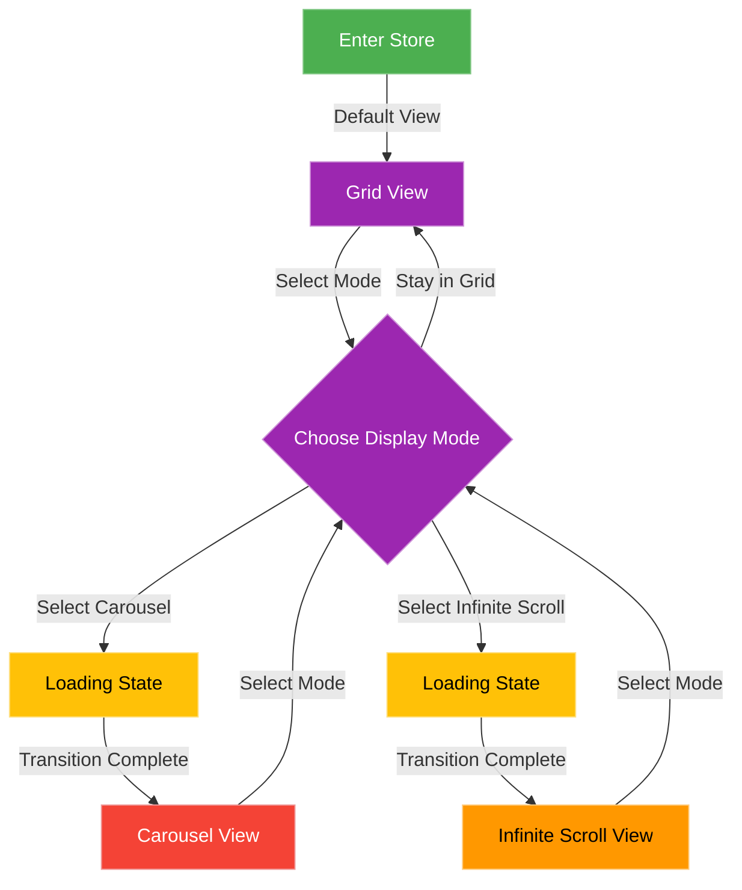
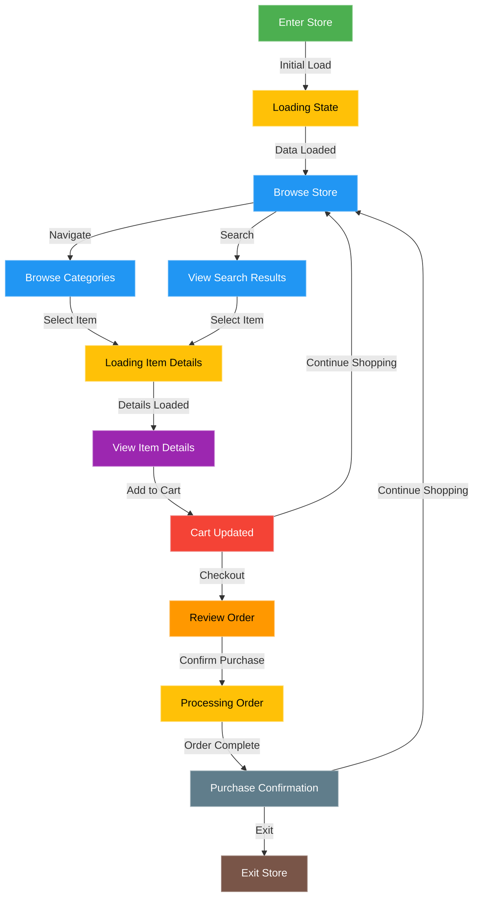
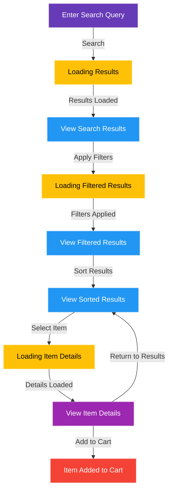
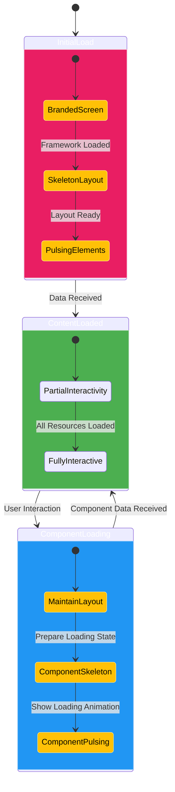
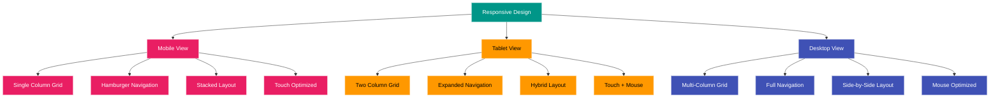

# Functional Specifications: Game Store Configuration Interface

[← Back to Documentation](../README.md) | [View Documentation Map](../DocNavigation.md)

## Navigation

- [📋 Main README](../README.md) - Overview of the entire documentation
- [📝 Project Analysis](../Analysis.md) - Analysis of the project requirements
- [🎨 Design Brief](../DesignBrief.md) - Design and ergonomics guidelines
- [📋 Analysis Overview](../2-Analysis/README.md) - Overview of the analysis process
- [🖼️ Wireframes](../1-Design/Wireframes.md) - Wireframes for the three display modes
- [💻 Technical Specifications](TechnicalSpecifications.md) - Technical implementation details
- [✅ Implementation Plan](../4-Todo/README.md) - Tasks and timeline for implementation

## Introduction

This document outlines the functional specifications for the game store configuration interface prototype. It details the core features, user flows, and interaction patterns that will be implemented based on our analysis of existing game stores and design recommendations. These specifications are adapted for a 3-day test project with limited scope.

## Project Constraints

Before detailing the functional specifications, it's important to acknowledge the key constraints of this project:

1. **Timeline**: 3 days for implementation
2. **Scope**: Frontend prototype only, focusing exclusively on what is requested in the instructions
3. **Backend**: No actual backend development; API access will be simulated with JSON file loading
4. **Administrative Interface**: Conceptual design only, no implementation in the prototype

## User Roles

For this prototype, we will focus primarily on the player experience, with simulated authentication:

### Player Role

Players will interact with the store interface to browse, discover, and simulate purchases. Their capabilities include:

1. **Browsing Capabilities**
   - View available items in the store
   - Access item details and descriptions
   - View pricing information
   - Navigate between categories
   - Switch between different display modes (Carousel, Grid, Infinite Scroll)

2. **Transaction Capabilities**
   - Add items to cart
   - Simulate purchases (no actual payment processing)
   - View cart contents

## Core Functionality

### Display Modes

The store interface will implement three distinct display modes as required:

#### 1. Carousel View

**Description:**  
A focused display that showcases one product at a time with maximum visual impact, allowing users to navigate through items sequentially.

**Requirements:**
1. Large central display for showcasing one product at a time
2. Navigation arrows for browsing through items sequentially
3. Pagination indicators showing position in the sequence
4. Featured items section below the carousel
5. Prominent product information display
6. Skeleton loading states during initial load and transitions

**User Interactions:**
1. Click/tap on navigation arrows to move between items
2. Click/tap on pagination indicators to jump to specific items
3. Click/tap on item to view details
4. Add item to cart directly from carousel view

#### 2. Grid View

**Description:**  
A structured layout displaying multiple items simultaneously in a grid format, facilitating efficient browsing and comparison.

**Requirements:**
1. Multi-column grid layout that adapts to screen size
2. Filtering and sorting options
3. Pagination controls for navigating between pages
4. Compact item cards with essential information
5. Quick add-to-cart functionality
6. Skeleton grid placeholders during loading

**User Interactions:**
1. Filter items by various criteria
2. Sort items by relevance, price, etc.
3. Navigate between pages of results
4. Click/tap on item to view details
5. Add item to cart directly from grid

#### 3. Infinite Scroll View

**Description:**  
A continuous scrolling experience where items load automatically as the user scrolls down, encouraging exploration and discovery.

**Requirements:**
1. Automatic loading of new items as user scrolls
2. Detailed item cards with more information
3. Loading indicators when fetching new items
4. Filtering options that apply to the infinite list
5. Horizontal layout with image and details side-by-side
6. Skeleton placeholders at the bottom during loading

**User Interactions:**
1. Scroll down to load more items
2. Filter items by various criteria
3. Click/tap on item to view details
4. Add item to cart directly from the list

### Store Display

#### Item Detail View

**Description:**  
Expanded view showing comprehensive information about a selected item.

**Requirements:**
1. Display item imagery
2. Show item description and specifications
3. Present pricing information with any applicable discounts
4. Display item rarity, category, and other metadata
5. Show related or recommended items
6. Provide clear purchase/add to cart actions
7. Skeleton loading state while item details are being fetched

**User Interactions:**
1. View item details
2. Add item to cart
3. Return to previous view

#### Category Navigation

**Description:**  
System for organizing and navigating between different item categories.

**Requirements:**
1. Display main categories in a prominent navigation bar
2. Support hierarchical subcategories with intuitive navigation
3. Provide visual indicators for current category
4. Implement responsive design for different screen sizes
5. Skeleton loading states for category navigation during initial load

**User Interactions:**
1. Select category to view associated items
2. Navigate between parent and child categories
3. Filter items within a category

### Search and Discovery

#### Search Functionality

**Description:**  
Basic system allowing users to find specific items through text-based queries.

**Requirements:**
1. Implement responsive search with basic filtering
2. Support partial matching
3. Display search results in consistent grid format
4. Provide helpful suggestions for zero-result searches
5. Skeleton loading states for search results

**User Interactions:**
1. Enter search terms in search field
2. Filter and sort search results
3. Clear search and return to browsing

#### Featured Items

**Description:**  
Highlighted items prominently displayed to attract attention.

**Requirements:**
1. Support configurable featured item sections
2. Implement carousel/slider for multiple featured items
3. Display promotional banners with clear messaging
4. Support responsive layouts for different screen sizes
5. Skeleton loading states for featured items during initial load

**User Interactions:**
1. Navigate through featured item carousel
2. Click/tap on promotional banners

### Purchase Flow

#### Cart System

**Description:**  
Temporary storage for items selected for purchase before checkout.

**Requirements:**
1. Allow adding/removing items from cart
2. Display cart summary with item count and total cost
3. Support quantity adjustments for items
4. Calculate and display subtotal, discounts, and final price
5. Persist cart contents across sessions (using localStorage)
6. Skeleton loading states when updating cart

**User Interactions:**
1. Add items to cart
2. Remove items from cart
3. Adjust item quantities
4. Clear entire cart
5. Proceed to checkout
6. Continue shopping

#### Checkout Process

**Description:**  
Simplified process for completing simulated purchases.

**Requirements:**
1. Implement streamlined checkout with minimal steps
2. Display order summary with all items and costs
3. Provide clear confirmation before final purchase
4. Display helpful error messages for simulated failed transactions
5. Skeleton loading states during checkout processing

**User Interactions:**
1. Review cart contents
2. Confirm purchase
3. View purchase confirmation
4. Return to store

## User Flows

### Player Flows

#### Display Mode Switching Flow

1. User enters store interface (default view is Grid)
2. User selects alternative display mode (Carousel or Infinite Scroll)
3. System shows skeleton loading state during transition
4. System transitions to the selected display mode
5. User interacts with items in the new display mode
6. User can switch to another display mode at any time



#### Browse and Purchase Flow

1. User enters store interface
2. System shows skeleton loading state while fetching initial data
3. User navigates categories or featured items
4. User selects item of interest
5. System shows skeleton loading state while fetching item details
6. User views detailed item information
7. User adds item to cart
8. User proceeds to checkout
9. User reviews order and confirms purchase
10. System shows skeleton loading state during purchase processing
11. User receives purchase confirmation
12. User returns to store or exits



#### Search and Discovery Flow

1. User enters search query
2. System shows skeleton loading state while fetching search results
3. User reviews search results
4. User applies filters to refine results
5. System shows skeleton loading state while applying filters
6. User sorts results by preferred criteria
7. User selects item from results
8. User views item details
9. User makes purchase decision



## Interface States

### Loading States

1. **Initial Load**
   - Display branded loading screen
   - Show progress indicator
   - Preload essential UI elements
   - Display skeleton placeholders for content areas

2. **Content Loading**
   - Implement skeleton screens for content areas
   - Show subtle loading indicators
   - Maintain existing content until new content is ready
   - Use consistent skeleton design language across all components

3. **Skeleton Implementation**
   - Product cards: Skeleton rectangles for images, lines for text
   - Carousel: Skeleton rectangle for main image, lines for text
   - Detail view: Skeleton layout matching the full detail view
   - Navigation: Skeleton blocks for category buttons
   - Cart: Skeleton lines for cart items



### Empty States

1. **Empty Search Results**
   - Display helpful message
   - Suggest alternative search terms
   - Offer popular items as alternatives

2. **Empty Cart**
   - Show friendly message
   - Suggest featured items
   - Provide clear path back to shopping

### Error States

1. **Connection Errors**
   - Display clear error message
   - Offer retry option

2. **Transaction Errors**
   - Show specific error reason
   - Suggest resolution steps

## Responsive Design Requirements

1. **Mobile View (320px - 639px)**
   - Single column grid for items
   - Simplified navigation with hamburger menu
   - Full-width item details
   - Streamlined checkout process
   - Carousel with touch swipe navigation
   - Infinite scroll with stacked layout
   - Optimized skeleton loading states for smaller screens

2. **Tablet View (640px - 1023px)**
   - Two-column grid for items
   - Expanded navigation
   - Optimized item details layout
   - Side-by-side cart and checkout summary
   - Carousel with touch and button navigation
   - Infinite scroll similar to desktop
   - Proportionally sized skeleton loading states

3. **Desktop View (1024px and above)**
   - Multi-column grid for items
   - Full navigation with dropdowns
   - Enhanced item details with larger images
   - Optimized checkout experience
   - Carousel with button navigation
   - Infinite scroll with side-by-side layout
   - Full-sized skeleton loading states



## Accessibility Requirements

1. **Keyboard Navigation**
   - All interactive elements must be keyboard accessible
   - Logical tab order throughout interface
   - Visible focus indicators

2. **Screen Reader Support**
   - Semantic HTML structure
   - Appropriate ARIA attributes for complex components
   - Meaningful alt text for images
   - Proper labeling of skeleton loading states for screen readers

3. **Visual Accessibility**
   - Sufficient color contrast
   - Text resizing without loss of functionality
   - No reliance on color alone for information
   - Subtle animation for skeleton loading states with reduced motion option

## Performance Requirements

1. **Response Times**
   - Store interface should load within 2 seconds
   - Item details should load within 1 second
   - Search results should appear within 500ms
   - Cart updates should be immediate
   - Skeleton loading states should appear within 100ms of request initiation

2. **Animation Performance**
   - Smooth transitions between views
   - Optimized animations for mobile devices
   - Respect reduced motion preferences
   - Subtle pulse animation for skeleton loading states

## Mock Data Structure

The prototype will use the following JSON data structures:

### Products

```json
{
  "products": [
    {
      "id": "product-1",
      "name": "Product Name",
      "description": "Product description...",
      "price": 1000,
      "discountedPrice": 800,
      "currency": "coins",
      "rarity": "legendary",
      "category": "weapons",
      "subcategory": "swords",
      "tags": ["new", "featured"],
      "imageUrl": "/images/products/product-1.jpg",
      "thumbnailUrl": "/images/products/thumbnails/product-1.jpg",
      "relatedProducts": ["product-2", "product-3"]
    }
  ]
}
```

### Categories

```json
{
  "categories": [
    {
      "id": "weapons",
      "name": "Weapons",
      "subcategories": [
        {
          "id": "swords",
          "name": "Swords"
        },
        {
          "id": "bows",
          "name": "Bows"
        }
      ]
    }
  ]
}
```

### Featured Items

```json
{
  "featured": {
    "heroItems": ["product-1", "product-2"],
    "dailyItems": ["product-3", "product-4", "product-5"],
    "onSale": ["product-6", "product-7"]
  }
}
```

## Store Administration Interface

While not implemented in the prototype, a conceptual design for the store administration interface has been created (see `test-frontend/doc/1-Design/AdminInterface.md`). This design outlines:

1. **User Roles and Permissions**
   - Store Administrator
   - Content Manager
   - Analyst

2. **Core Functionality**
   - Product Management
   - Store Layout Configuration
   - Scheduled Updates & Promotions
   - Store Preview Mode
   - Testing & Publishing
   - Analytics Dashboard

3. **User Flows**
   - Product Creation and Publishing
   - Store Layout Configuration
   - Promotion Creation
   - Version Deployment

This conceptual design serves as a blueprint for future development phases.

## Implementation Priorities

Given the 3-day timeline, we will prioritize features in the following order:

### Day 1: Core Structure and Display Modes
1. Basic store layout and navigation
2. Implementation of the three display modes:
   - Grid View
   - Carousel View
   - Infinite Scroll View
3. Category filtering
4. Skeleton loading components for all views

### Day 2: Product Details and Cart
1. Product detail view
2. Add to cart functionality
3. Cart management
4. Display mode switching
5. Skeleton loading states for product details and cart

### Day 3: Refinement and Polish
1. Checkout flow
2. Search functionality
3. Visual polish and animations
4. Responsive design refinements
5. Finalize skeleton loading animations

```mermaid
gantt
    title Implementation Timeline
    dateFormat  YYYY-MM-DD
    axisFormat %d
    
    section Day 1
    Project Setup           :a1, 2023-04-01, 2h
    Basic Layout            :a2, after a1, 2h
    Grid View               :a3, after a2, 2h
    Carousel View           :a4, after a3, 2h
    Infinite Scroll         :a5, after a4, 2h
    
    section Day 2
    Product Details         :b1, 2023-04-02, 2h
    Cart Functionality      :b2, after b1, 2h
    Mode Switching          :b3, after b2, 2h
    Skeleton States         :b4, after b3, 2h
    
    section Day 3
    Checkout Flow           :c1, 2023-04-03, 2h
    Search Function         :c2, after c1, 2h
    Visual Polish           :c3, after c2, 2h
    Responsive Design       :c4, after c3, 2h
    
    classDef day1 fill:#E91E63,stroke:#F8BBD0,color:white
    classDef day2 fill:#2196F3,stroke:#90CAF9,color:white
    classDef day3 fill:#4CAF50,stroke:#A5D6A7,color:white
```

## Conclusion

These functional specifications provide a framework for implementing the game store configuration interface prototype within the constraints of a 3-day test project. By focusing on the three required display modes (Carousel, Grid, Infinite Scroll) and core functionality, we can create a compelling demonstration of the key concepts from our design recommendations.

The implementation will prioritize:
- The three required display modes
- Skeleton loading states for improved user experience
- Essential shopping functionality
- Clean, intuitive user interface
- Responsive design
- Visual polish

By simulating backend functionality with JSON files and focusing exclusively on the requested features, we can deliver a high-quality frontend prototype within the 3-day timeline. 